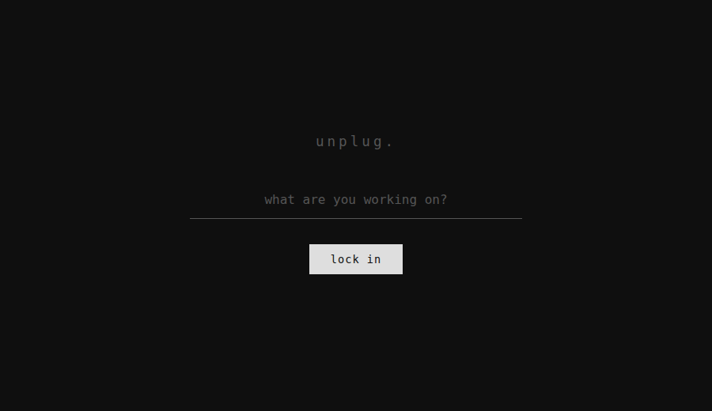

# Unplug

A minimal focus timer that punishes tab switching. Built this because every other focus app I tried was either too bloated or needed an account.

---

## Preview



---

## What it does

You type what you're working on, hit lock in, and the timer starts. If you switch tabs or minimize the window, the timer stops and logs it as an interruption. That's it.

---

## Project structure

```
unplug/
  index.html
  css/
    style.css
  js/
    main.js
  README.md
```

---

## How to run

Just open `index.html` in a browser. No installs, no build step, no dependencies.

---

## Known issues

- Timer resets if you refresh the page (no persistence yet)
- On mobile the visibilitychange event is unreliable
- Might add localStorage for session history later, haven't decided

---

## Built with

Plain HTML, CSS and vanilla JS. Nothing else.
